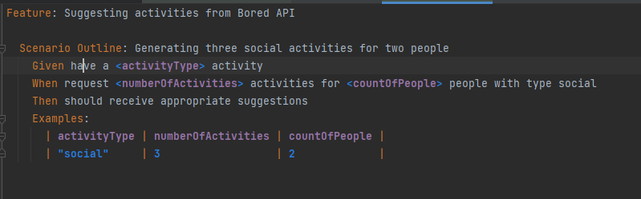
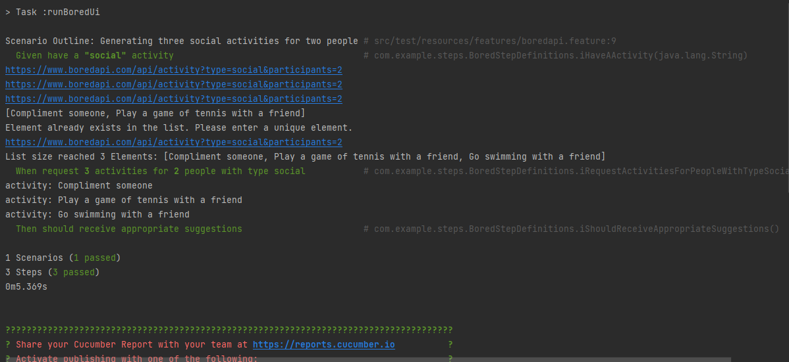
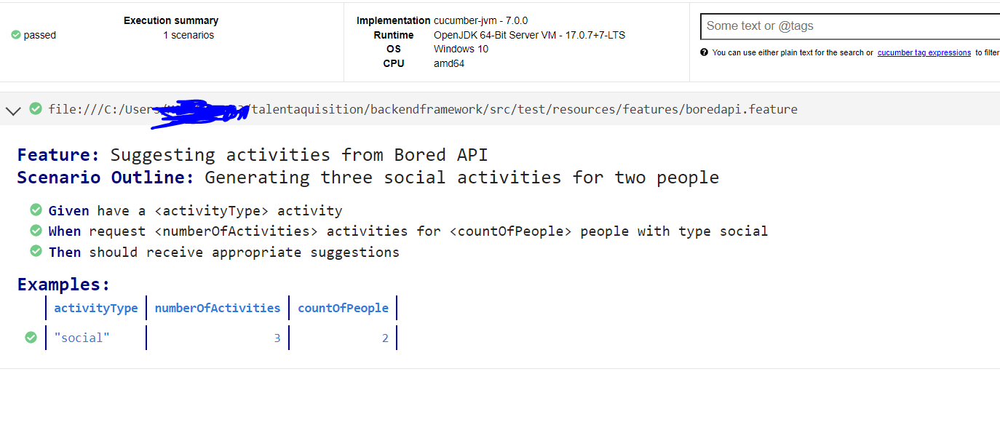

    project
    └── src
    └── test
    ├── java
    │   └── com
    │       └── example
    │           
    │           ├── runner
    │           │   └── TestRunner.java
    │           └── steps
    │               └── BoredStepDefinitions.java
    └── resources
    ├── application.properties
    └── features
        └── boredapi.feature

To run 

just run the task by right click on intellij or on gradle command line 
        
    runBoredUi

Attaching test execution report for the test result and console output

